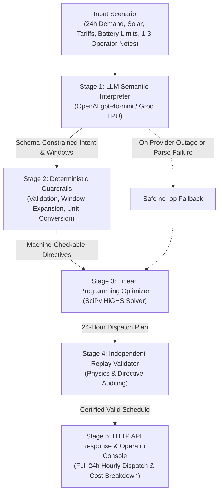

# GridWise — Smart Campus Energy Optimization

[](https://www.python.org/)
[](https://fastapi.tiangolo.com/)
[](https://scipy.org/)
[](https://react.dev/)
[](https://www.typescriptlang.org/)
[](https://www.docker.com/)
[](https://openai.com/)
[](https://groq.com/)

GridWise is an intelligent energy scheduling service that unifies Large Language Model (LLM) natural-language interpretation, deterministic validation guardrails, and exact linear programming to optimize 24-hour campus energy dispatch. By translating unstructured operator notes into rigorous mathematical constraints, GridWise minimizes electricity purchase costs while orchestrating battery storage, solar self-consumption, and grid imports with verified operational safety.

- **Live Application & Operator Console**: [https://gridwise-hampton.onrender.com](https://gridwise-hampton.onrender.com)
- **API Health Endpoint**: [https://gridwise-hampton.onrender.com/health](https://gridwise-hampton.onrender.com/health)
- **Optimization Endpoint**: `POST https://gridwise-hampton.onrender.com/optimize-energy`

---

## Why GridWise?

Modern educational and commercial campuses operate complex microgrid assets—rooftop photovoltaic (PV) arrays, stationary battery energy storage systems (BESS), critical facilities with fluctuating hourly demand, and time-varying grid tariff structures. 

Traditional energy management systems (EMS) rely strictly on rigid, numerical constraint matrices. In daily operations, however, operational directives originate from facility managers, maintenance engineers, and campus administrators in plain English:

> *"Rooftop array offline for cleaning 10:00–12:00; assume zero solar in that slot."*  
> *"Hold no less than 40% of battery capacity between 5 PM and 9 PM for the exam-hall backup."*  
> *"Substation feeder derated: cap grid draw at 140 kW between 5 PM and 8 PM."*

Bridging the gap between human instructions and mathematical solvers is historically error-prone. Direct numerical prompting of LLMs yields arithmetic hallucinations and constraint violations. 

**GridWise solves this through strict separation of concerns**:
1. An LLM performs **linguistic semantic parsing** into high-level structured intent without doing arithmetic.
2. A deterministic Python guardrail layer **sanitizes, converts, and verifies** intervals and physical boundaries.
3. An industrial-grade Linear Programming solver (**HiGHS**) calculates the **globally optimal dispatch**.
4. An independent replay engine **proves schedule validity** before any response leaves the service.

---

## What GridWise Does

- **Natural Language Operator Instructions**: Ingests 1–3 free-form operator notes alongside 24-hour forecasts of campus electrical demand, solar output, and utility tariffs.
- **Semantic Interpretation Without Hallucination**: The language model identifies intent and time bounds without performing numerical optimization or battery physics calculations.
- **Deterministic Guardrails**: Validates and normalizes model outputs—expanding window intervals into discrete hourly slots, converting percentage reserves to kilowatt-hours, and clamping parameters against physical battery limits.
- **Cost-Optimal Dispatch Formulation**: Employs linear programming via SciPy/HiGHS to minimize grid electricity procurement cost across the 24-hour planning horizon.
- **Comprehensive Battery Management**: Respects total capacity, minimum reserve levels, hourly charge and discharge rate limits, internal state-of-charge transitions, and end-of-day storage neutrality.
- **Solar-Aware Scheduling**: Maximizes utilization of rooftop solar while honoring localized solar deratings or maintenance blackouts.
- **Independent Replay Verification**: A standalone validation layer audits the resulting schedule against physical conservation of energy and active directives.
- **Safe Failure & Fallback**: If an LLM provider times out or returns malformed output, the system safely falls back to a `no_op` (no operation) directive, ensuring valid baseline schedules are always generated.

---

## How It Works



---

## System Architecture

GridWise is organized into five decoupled, testable layers:

### 1. API Layer (`app/main.py`)
Built on **FastAPI**, handling high-throughput asynchronous HTTP requests. It strictly validates request schemas using **Pydantic v2**, returning structured HTTP 400 errors for malformed requests (e.g., non-24-hour intervals, negative demand, invalid battery specifications). It also serves the compiled React single-page operator console from `/`.

### 2. LLM Interpretation Layer (`app/llm/interpreter.py`)
Communicates with OpenAI-compatible endpoints using structured JSON schema output modes. It extracts directive types, time windows, and typed values. It enforces strict request deadlines and hedged requests to ensure prompt responses.

### 3. Guardrail & Normalization Layer (`app/directives.py`)
Acts as a deterministic boundary between the stochastic model output and the mathematical optimizer:
- Validates note ordering (`0..N-1`) and rejects unsupported directive types.
- Expands continuous time windows (including midnight-crossing intervals like `22:00 -> 02:00`) into discrete integer hour sets ($[0, 23]$).
- Converts relative percentage reserves into absolute kilowatt-hours based on the scenario's battery capacity.
- Clamps values into physically feasible intervals ($[0, 1]$ for solar factors, non-negative bounds for grid caps).
- Ensures that invalid or irrelevant notes degrade to a transparent `no_op`.

### 4. Mathematical Optimization Layer (`app/optimizer.py`)
Translates the campus scenario and active directives into a standard Linear Program (LP) solved by **HiGHS** via `scipy.optimize.linprog(method="highs")`. If contradictory operator notes cause infeasibility, a soft-constraint relaxation penalty solver ensures an optimal baseline plan is still produced without violating physical hardware constraints.

### 5. Independent Validation Layer (`app/validator.py`)
Performs a ground-truth replay simulation of the proposed schedule. It independently checks:
- Hourly energy balance: $\text{Grid} + \text{Solar Used} + \text{Discharge} - \text{Charge} = \text{Demand}$.
- Solar upper bounds: $\text{Solar Used} \le \text{Effective Solar}$.
- Battery storage transitions and bounds: $E_h = E_{h-1} + C_h - D_h$, $E_{\min} \le E_h \le C_{\text{capacity}}$.
- C-rate limits: $C_h \le C_{\max}$, $D_h \le D_{\max}$.
- End-of-day battery neutrality: $E_{23} = E_{\text{initial}}$.
- Active directive adherence within $0.01$ numerical tolerance.

---

## LLM + Guardrail Design

The core engineering principle of GridWise is:  
**The language model interprets human language; deterministic code enforces mathematics, physics, and validation.**

```
Operator Note:
"Cloud cover will cause an 80% drop in solar generation between 1 PM and 3 PM."
                                │
                                ▼
Stage 1: LLM Linguistic Extraction (No Arithmetic)
{
  "directive_type": "solar_reduction",
  "windows": [{"start_hour": 13, "end_hour_exclusive": 15}],
  "value_kind": "usable_solar_fraction",
  "value": 0.2,
  "explanation": "Solar drops by 80%, leaving 20% usable output."
}
                                │
                                ▼
Stage 2: Deterministic Guardrail Validation (app/directives.py)
- Verifies hours in [0, 23]: expands window [13, 15) to [13, 14]
- Validates fraction in [0.0, 1.0]: factor = 0.20
- Emits canonical machine-readable directive:
  {
    "note_index": 0,
    "applies": true,
    "directive_type": "solar_reduction",
    "structured_adjustment": {"hours": [13, 14], "factor": 0.2},
    "explanation": "Solar reduction for the stated hours."
  }
                                │
                                ▼
Stage 3: LP Optimizer Injection (app/optimizer.py)
Adds hard upper-bound constraints to the solver:
  solar_used[13] <= 0.2 * solar_forecast[13]
  solar_used[14] <= 0.2 * solar_forecast[14]
```

### Colloquial Phrasing & Temporal Robustness
The interpreter prompt is engineered to handle nuanced operational phrasing:
- **Colloquial Times**: Expressions such as *"from dusk until 9 PM"* map dusk to 18:00 (`hours: [18, 19, 20]`).
- **Partial Hour Boundaries**: Intervals like *"quarter to 2 PM until 4 PM"* (13:45 to 16:00) safely expand outward to cover all affected one-hour steps (`hours: [13, 14, 15]`).
- **Power vs. Energy Units**: Power limits expressed as *"cap at 150 kW"* for a 1-hour interval are normalized to $150\text{ kWh/h}$.
- **Implicit Grid Ceilings**: Phrasing such as *"keep intake to no more than 150"* parses the implicit numeric threshold.
- **Out-of-Scope Temporal Distractors**: Notes referencing other days (*"tomorrow"*, *"next Tuesday"*, *"yesterday"*) or general non-energy notices (cafeteria menus, seminar room bookings) are safely identified as `no_op`.

---

## Supported Directives

| Directive Type | Purpose | Structured Adjustment Schema | Optimization Effect |
|:---|:---|:---|:---|
| `solar_reduction` | Derate usable rooftop solar during specific hours | `{"hours": [int, ...], "factor": float}` | Limits solar consumption: $s_h \le \text{factor} \times \text{solar}_h$ |
| `minimum_battery_reserve` | Mandate an emergency energy reserve floor | `{"hours": [int, ...], "minimum_energy_kwh": float}` | Enforces state-of-charge floor: $e_h \ge \text{reserve}$ |
| `no_charge_window` | Prohibit battery charging during outage/maintenance | `{"hours": [int, ...]}` | Locks charging: $c_h = 0$ |
| `no_discharge_window` | Prohibit drawing energy from the battery | `{"hours": [int, ...]}` | Locks discharging: $d_h = 0$ |
| `max_grid_window` | Restrict grid import due to feeder/substation limits | `{"hours": [int, ...], "max_grid_kwh": float}` | Caps grid draw: $g_h \le \text{max\_grid\_kwh}$ |
| `no_op` | Disregard irrelevant notes or past/future day instructions | `null` (`applies: false`) | No effect on dispatch; optimizes standard scenario |

---

## Optimization Model

GridWise models the 24-hour dispatch problem as a standard Linear Program (LP):

$$\min \quad \sum_{h=0}^{23} \Big( \text{tariff}_h \cdot g_h \Big)$$

### Decision Variables (for each hour $h \in \{0, \dots, 23\}$):
- $g_h \ge 0$: Electricity purchased from the utility grid ($\text{kWh}$)
- $s_h \ge 0$: Rooftop solar energy consumed directly by campus or battery ($\text{kWh}$)
- $c_h \ge 0$: Energy routed to charge the battery ($\text{kWh}$)
- $d_h \ge 0$: Energy discharged from the battery to supply campus load ($\text{kWh}$)
- $e_h \ge 0$: Battery state-of-charge at the conclusion of hour $h$ ($\text{kWh}$)

### Operational & Physical Constraints:
1. **Hourly Campus Demand Balance**:
   $$g_h + s_h + d_h - c_h = \text{demand}_h \quad \forall h$$
2. **Solar Resource Limits**:
   $$s_h \le \text{solar}_h \cdot \text{factor}_h \quad \forall h$$
3. **Battery Energy Conservation & Continuity**:
   $$e_h = e_{h-1} + c_h - d_h \quad \text{with } e_{-1} = E_{\text{initial}}$$
4. **Battery Capacity & Reserve Bounds**:
   $$\max(E_{\min}, \text{reserve}_h) \le e_h \le C_{\text{capacity}} \quad \forall h$$
5. **C-Rate Charging & Discharging Limits**:
   $$0 \le c_h \le C_{\max}, \quad 0 \le d_h \le D_{\max} \quad \forall h$$
6. **End-of-Day Storage Neutrality**:
   $$e_{23} = E_{\text{initial}}$$
7. **Grid Capacity Ceilings**:
   $$g_h \le \text{max\_grid}_h \quad \forall h$$

The solver runs using `scipy.optimize.linprog(method="highs")`. Following the solve, each hour is collapsed into a single discrete battery state (`charge`, `discharge`, or `idle`), and grid import is computed from the rounded components to ensure exact arithmetic precision.

---

## Safety and Reliability

- **Deterministic Validation**: Every raw model generation must pass structural and numeric schema validation before reaching the optimizer.
- **Safe Fallback**: Any syntax error, timeout, or unexpected response defaults that specific note to `no_op`, allowing the campus to maintain power safely.
- **Independent Replay Verification**: Plans are audited against the physical system parameters prior to returning HTTP 200.
- **Controlled Error Handling**: Malformed client inputs yield structured HTTP 400 responses with exact field path annotations, while internal errors return sanitized generic messages.
- **Zero Secret Leakage**: API tokens, system prompts, and raw client credentials are never reflected in error payloads, logs, or client-side bundles.
- **Hedged Provider Fallback**: Supports concurrent failover between OpenAI and Groq to guarantee high availability and low latency.

---

## LLM Providers

| Provider | Model | Role | Characteristics |
|:---|:---|:---|:---|
| **OpenAI** | `gpt-4o-mini` | Primary / Configurable | Strict JSON schema mode, high extraction precision |
| **Groq** | `openai/gpt-oss-120b`, `llama-3.3-70b-versatile` | Fallback / High Speed | Ultra-low latency LPU inference ($<1.5\text{ s}$) |

### Configuration Options
- **Dynamic Selection**: Configured via `LLM_PROVIDER=openai` or `LLM_PROVIDER=groq` in `.env`.
- **Hedged Requests**: If the primary provider does not respond within `LLM_HEDGE_AFTER_S` (default $2.5\text{ s}$), a parallel request is issued to the fallback provider.
- **Overall Request Deadline**: Bounded by `LLM_TIMEOUT_S` (default $20\text{ s}$).
- **In-Memory Cache**: Repeated notes within identical battery setups are served instantly from an LRU interpretation cache (`LLM_CACHE=1`).

---

## API Reference

### 1. Health Check
```http
GET /health
```
**Response (200 OK):**
```json
{
  "status": "ok"
}
```

### 2. Energy Optimization
```http
POST /optimize-energy
Content-Type: application/json
```

#### Request Payload Example (`examples/sample-06.request.json`)
```json
{
  "scenario_id": "SAMPLE-06",
  "operator_notes": [
    "Cloud cover during panel inspection will leave about half of the forecast solar output from 10 AM until noon.",
    "The charging circuit will be unavailable from 2 PM until 4 PM.",
    "The library is extending book-return hours next week."
  ],
  "battery": {
    "capacity_kwh": 200,
    "initial_energy_kwh": 100,
    "minimum_energy_kwh": 20,
    "max_charge_kwh_per_hour": 50,
    "max_discharge_kwh_per_hour": 50
  },
  "hours": [
    {"hour": 0, "demand_kwh": 85, "solar_kwh": 0, "tariff_bdt_per_kwh": 5.0},
    {"hour": 1, "demand_kwh": 80, "solar_kwh": 0, "tariff_bdt_per_kwh": 5.0},
    "... (hours 2 through 23)"
  ]
}
```

#### Response Payload Example (`examples/sample-06.expected.json`)
```json
{
  "scenario_id": "SAMPLE-06",
  "directive_interpretation": [
    {
      "note_index": 0,
      "applies": true,
      "directive_type": "solar_reduction",
      "structured_adjustment": {
        "hours": [10, 11],
        "factor": 0.5
      },
      "explanation": "Usable solar is reduced to 50% during the stated inspection window."
    },
    {
      "note_index": 1,
      "applies": true,
      "directive_type": "no_charge_window",
      "structured_adjustment": {
        "hours": [14, 15]
      },
      "explanation": "Battery charging is unavailable during the charging-circuit outage."
    },
    {
      "note_index": 2,
      "applies": false,
      "directive_type": "no_op",
      "structured_adjustment": null,
      "explanation": "This note does not affect today's energy schedule."
    }
  ],
  "hourly_plan": [
    {
      "hour": 0,
      "grid_kwh": 105.0,
      "solar_used_kwh": 0.0,
      "battery_action": "charge",
      "battery_kwh": 20.0,
      "battery_energy_after_kwh": 120.0
    }
  ],
  "total_grid_kwh": 2395.0,
  "total_cost_bdt": 34090.0,
  "peak_grid_kwh": 175.0,
  "plan_summary": "Applies both the 50% solar reduction and the no-charge maintenance window, ignores the unrelated library note, and optimizes the remaining feasible schedule."
}
```

---

## Example End-to-End Workflow

1. **Operator Input**:  
   An operator submits a scenario containing the note:  
   *"Do not charge the battery between 2 PM and 4 PM."*
2. **Semantic Extraction**:  
   The model identifies the action as preventing energy intake, setting `directive_type: "no_charge_window"` and time window `[14, 16)`.
3. **Guardrail Sanitization**:  
   `app/directives.py` expands the window into discrete hours `[14, 15]`, sets `applies = true`, and formats the adjustment object.
4. **Linear Programming**:  
   `app/optimizer.py` sets $c_{14} = 0$ and $c_{15} = 0$. The solver schedules charging in earlier off-peak hours (e.g., hours 0–3) to ensure campus loads at 2 PM are supported cost-effectively.
5. **Replay Validation**:  
   `app/validator.py` verifies that $c_{14} == 0$ and $c_{15} == 0$, ensures energy balances across all 24 hours, and verifies that the battery returns to its initial state of charge by hour 23.
6. **Delivery**:  
   The verified hourly plan and financial summary are returned via the API and visualized on the operator console.

---

## Project Structure

```
gridWise/
├── app/                        # Backend API & core logic
│   ├── directives.py           # Guardrails, schema validation & normalization
│   ├── main.py                 # FastAPI application, routes & static mounting
│   ├── optimizer.py            # HiGHS linear programming dispatch optimizer
│   ├── schemas.py              # Pydantic data contracts (Request/Response/Directives)
│   ├── validator.py            # Independent replay simulation & rule auditor
│   └── llm/                    # LLM integration layer
│       └── interpreter.py      # OpenAI/Groq API client, prompt & JSON schema
├── frontend/                   # React operator console
│   ├── src/                    # TypeScript components, charts & state logic
│   ├── package.json            # Frontend dependencies (React 19, Recharts 3, Vite 8)
│   └── README.md               # Frontend development documentation
├── examples/                   # Public reference requests and expected responses
│   ├── sample-06.request.json  # Comprehensive multi-directive scenario request
│   └── sample-06.expected.json # Ground-truth reference schedule response
├── scripts/                    # CLI test and evaluation runners
│   ├── run_eval.py             # Paraphrase robustness & latency benchmark harness
│   └── run_public_cases.py     # Batch runner for public validation cases
├── tests/                      # Automated test suite (pytest)
│   ├── test_api.py             # HTTP endpoint & status code validation
│   ├── test_guardrails.py      # Guardrail unit tests & malformed model recovery
│   ├── test_optimizer.py       # LP correctness against reference solutions
│   ├── test_validator.py       # Replay validation engine tests
│   ├── fixtures/               # Public scenario test data
│   └── eval/                   # Paraphrase benchmark definitions (64 cases)
├── .env.example                # Template for environment configuration
├── Dockerfile                  # Multi-stage production container build
├── pytest.ini                  # Pytest test suite configuration
├── requirements.txt            # Python dependencies
└── README.md                   # Project documentation
```

---

## Local Development

### Prerequisites
- **Python 3.12+**
- **Node.js 20+** *(optional; only required to rebuild the frontend operator console)*
- An **OpenAI** or **Groq** API key

### 1. Clone & Environment Setup
```bash
git clone https://github.com/fairuz-anadi/gridWise.git
cd gridWise

python -m venv .venv
# On macOS / Linux:
source .venv/bin/activate
# On Windows:
# .venv\Scripts\activate

pip install -r requirements.txt
```

### 2. Configure Environment Variables
Copy the example environment template and add your API credentials:
```bash
cp .env.example .env
```
Edit `.env` with your active API key:
```env
LLM_PROVIDER=openai
OPENAI_API_KEY=your-openai-api-key-here
# Or use Groq:
# LLM_PROVIDER=groq
# GROQ_API_KEY=your-groq-api-key-here
```

### 3. Run the Development Server
```bash
uvicorn app.main:app --host 0.0.0.0 --port 8000
```
- API Health Check: `http://localhost:8000/health`
- Operator Console: `http://localhost:8000/` *(served when `frontend/dist` is built)*

---

## Docker Deployment

The production `Dockerfile` uses a two-stage build:
1. **Console Stage (`node:22-slim`)**: Compiles the React + Vite TypeScript frontend into static assets.
2. **Runtime Stage (`python:3.12-slim`)**: Installs Python dependencies, sets up a non-root security profile (`appuser`), and serves FastAPI + static assets via Uvicorn.

### Build and Run Locally
```bash
# Build Docker image
docker build -t gridwise:latest .

# Run container with environment configuration
docker run --rm -p 8000:8000 --env-file .env gridwise:latest
```

### Public Container Registry
A prebuilt container image is available on GitHub Container Registry:
```bash
docker pull ghcr.io/fairuz-anadi/gridwise@sha256:d03732b87e6f604ac7ddd5f132b07ea13db0e3083394cb2e8b15d5117b8d9418

docker run --rm -p 8000:8000 \
  -e LLM_PROVIDER=openai \
  -e OPENAI_API_KEY=your-key \
  ghcr.io/fairuz-anadi/gridwise@sha256:d03732b87e6f604ac7ddd5f132b07ea13db0e3083394cb2e8b15d5117b8d9418
```

---

## Testing & Evaluation

### 1. Offline Regression Suite
The offline test suite requires no external network access or API credentials. It validates schemas, LP optimality, guardrail rules, and replay audits:
```bash
pytest -q
```
**Test Coverage (91 passed tests):**
- `tests/test_api.py`: HTTP status codes, malformed JSON handling, input validation.
- `tests/test_guardrails.py`: Window expansions, boundary clamping, non-finite handling, outage resilience.
- `tests/test_optimizer.py`: LP solution cost matching across reference scenarios, soft resolution fallback.
- `tests/test_validator.py`: Catching simulated physics violations (energy imbalance, C-rate breaches, battery bounds).

### 2. Public Scenario Verification
Runs all ten public reference scenarios through the solver and replay auditor:
```bash
# Verify against local server:
python scripts/run_public_cases.py --url http://localhost:8000

# Verify against live deployed service:
python scripts/run_public_cases.py --url https://gridwise-hampton.onrender.com
```
*Result: `10/10 passed` with exact cost matching within 0.01 BDT.*

### 3. LLM Interpretation & Paraphrase Robustness Evaluation
The repository includes a dedicated evaluation harness (`scripts/run_eval.py`) that tests 64 diverse operator note paraphrases covering colloquial time intervals, dusk/dawn mappings, unit conversions, and temporal distractors:
```bash
# Test 1 note per request
python scripts/run_eval.py

# Test multi-note requests (3 notes batched per scenario)
python scripts/run_eval.py --batch 3

# Test against running server
python scripts/run_eval.py --url https://gridwise-hampton.onrender.com --batch 3
```

**Measured Accuracy Across 64 Benchmark Notes:**
- **Directive Application (`applies`)**: 100%
- **Directive Type (`directive_type`)**: 100%
- **Affected Hours (`hours`)**: 100%
- **Numeric Values (`structured_adjustment`)**: 100%
- **Overall Exact Match**: 100% (64/64 notes, median latency ~1.8s, p95 ~2.8s)

---

## Deployment

The service is configured for zero-downtime deployment on containerized hosting platforms (e.g., Render, Railway, AWS ECS):
- **Live Deployment**: [https://gridwise-hampton.onrender.com](https://gridwise-hampton.onrender.com)
- Root `/`: Interactive Operator Dashboard
- `/health`: Liveness probe for load balancers
- `/optimize-energy`: High-performance JSON API

---

## Challenge Context

GridWise was originally developed for the **BUP CSE Fest 2026 Software & AI Hackathon**, exploring LLM-assisted microgrid energy optimization under structured operational constraints.

---

## Team

- **Fairuz Anadi** — API Architecture, LP Optimizer, Replay Validator & Cloud Deployment
- **Turjo** — LLM Semantic Interpretation, Prompt Engineering & Deterministic Guardrails
- **Samprity Haque** — Frontend Operator Console, UI/UX Design & Technical Documentation

---

## Credits & Acknowledgements

- **HiGHS Optimization**: High-performance linear programming solver integrated via `scipy.optimize`.
- **FastAPI & Pydantic**: Asynchronous backend and strict data contract enforcement.
- **OpenAI & Groq**: Language models powering structured semantic extraction.
- **React & Recharts**: Interactive campus telemetry and dispatch schedule visualization.

---

## Known Limitations

- **Ambiguous Phrasing**: While the prompt and guardrail layer are hardened against common colloquialisms, extreme linguistic ambiguity may result in conservative `no_op` classification.
- **Total Provider Outages**: If all configured LLM providers are unreachable, directives default to `no_op` (with a transparent message in the explanation), and optimization proceeds using physical campus constraints alone.
- **Overlapping Directive Semantics**: Overlapping solar reductions multiply factors (taking the more restrictive derating), while overlapping reserves or grid caps apply the strictest limit.
- **Process-Local Caching**: The built-in LRU interpretation cache is process-local and does not synchronize across distributed, multi-instance horizontal replicas.
